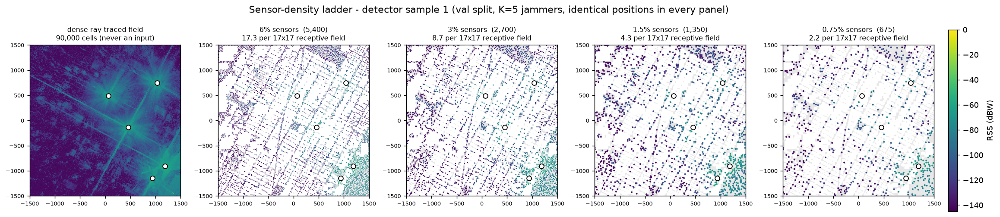
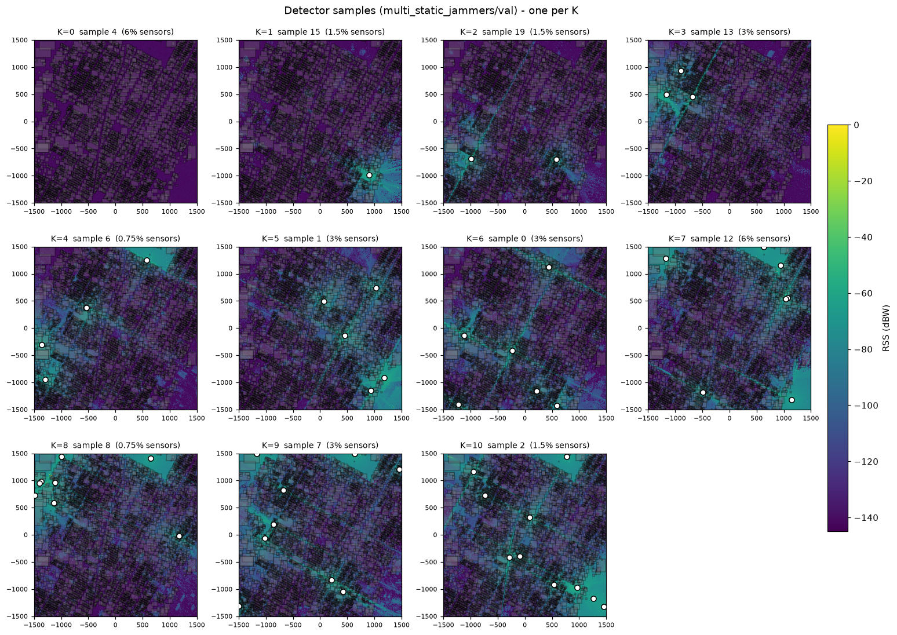
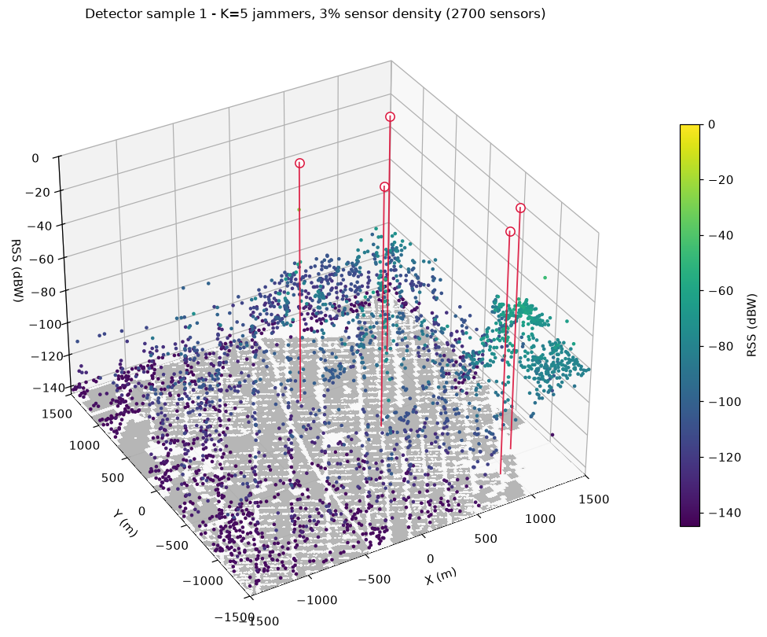
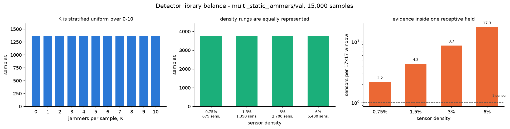
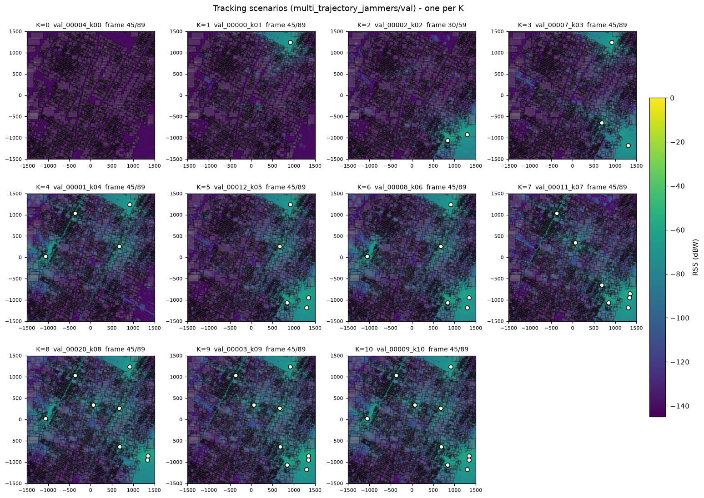

# Batch Simulation — NYC 3 km

Dataset for GNSS jammer **detection** (DeepMTL-style) and **tracking** (PMBM), built with
Sionna RT on the `NYC3KM_585751_4512036` scene.

Batch datasets live in `datasets/` and are named **`batch_simulation_<tag>`**. Every one has
the same internal layout, so `--dataset-dir` is the only path the pipeline needs.

There are **two branches**, because detection and tracking want different data. Each has a
*single*-jammer base library (ray traced, GPU) and a *multi*-jammer combination built from it
(NumPy, CPU):

```
datasets/batch_simulation_nyc/          <- --dataset-dir
├── README.md
├── splits.json                  static positions, sample specs, pools, scenarios
├── labels/                      per-frame jammer positions
├── sensors/                     per-scenario sensor layouts
│
│   ── DETECTION ──────────────────────────────────────────────────────────
├── single_static_jammers/       N static positions, one map each       [GPU]
│   ├── positions.npy            (N, 3) float64, continuous metres
│   └── watts.npy                (N, 300, 300) float32, memmap-able
├── multi_static_jammers/        100 000 detector samples               [CPU]
│   └── {train,val,test}/{rss.npy, labels.npz, meta.npz}
│
│   ── TRACKING ───────────────────────────────────────────────────────────
├── single_trajectory_jammers/   54 trajectories, one map per frame     [GPU]
│   ├── traj_*.npy / .json
│   └── radio_maps/
└── multi_trajectory_jammers/    5000 scenarios                         [CPU]
    └── {train,val,test}/<scenario_id>/{rss_aggregated.npy, scenario_summary.json, labels.npz}
```

**Why the detector gets its own library.** DeepMTL is a single-snapshot model — motion is irrelevant. Sampling from trajectories would confine every training jammer to 54 corridors with adjacent frames correlated at r = 0.884. Independent static positions cost the same 0.235 s of GPU each and scatter over the whole street network. It also removes a methodological trap: the detector never sees a trajectory frame, so detections fed to the tracker are **out-of-sample by construction**.

> **Dataset fully generated.** GPU job 10357699 (2026-09-15, ~1.9 h) produced all 54 trajectory maps and 20 000 static maps. CPU job 10361058 (2026-09-15) produced all scenarios, samples, splits, and labels — 13/13 validation checks passed.

---

## Design decisions

| | Decision | Why |
|---|---|---|
| Grid | **300 × 300 @ 10 m**, bounds ±1500 m | Same cell size as DeepMTL, so their metrics in metres and their blob/anchor hyperparameters transfer directly |
| **Detection** — static positions | **20 000**, split **14 000 / 3 000 / 3 000** at random | 78 min GPU, 7.2 GB; random split because samples combine K of them under fresh noise and sensors |
| **Detection** — detector samples | **70 000 / 15 000 / 15 000** = 100 000 | Matches DeepMTL's dataset scale |
| **Tracking** — trajectory pools | **34 / 10 / 10**, disjoint, stratified over duration × velocity | Bases are reused in hundreds of scenarios; sharing one across splits leaks geometry and multipath |
| **Tracking** — tracking scenarios | **4000 / 500 / 500** = 5000, from the 34/10/10 pools | |
| K (jammers) | **0–10, stratified** (equal count per K) | A uniform draw over subsets yields ≤ 1 noise-only scenario per split; stratified gives 364 (train) and 46 (val, test) |
| RSS storage | **full dense grid**, every cell | Sensor sub-sampling is preprocessing, so density can change without regenerating |
| Sensor placement | **street cells only** (30.9 % of the grid), fresh layout per scenario, min-spacing relocation | Indoor GNSS receivers are not useful sensors; no train/test partition, which would bias the splits |
| Sensor density | **6 / 3 / 1.5 / 0.75 %**, equal counts per level, drawn per sample | Chosen on **sensors per receptive field**, not link budget — see [Why this ladder](#why-this-density-ladder). 6 % reproduces DeepMTL's default; the informative direction is down. |
| TX power | **fixed 10 dBW** — settled, not varied | Free to add later without re-tracing (see [Free augmentation: TX power](#free-augmentation-tx-power)); out of scope for this paper |
| Measurement noise | **Gaussian in dB**, var 1.0 (σ = 1 dB, INR 10 dB) | Matches the sensor-noise model and INR sweep from the federated localization work |
| Precision | **float16** on disk | Quantisation inflates noise by 0.07 % at σ = 1 dB — irrelevant |

### Fixed scene parameters

| Parameter | Value |
|---|---|
| Scene | `data/NYC3KM_585751_4512036/simple_OSM_scene.xml` |
| Map bounds | x, y ∈ [−1500, +1500] m |
| Jammer altitude | z = 1.5 m |
| Carrier | 1.57542 GHz (GPS L1) |
| Noise floor | 8 × 10⁻¹⁵ W (= −140.97 dBW), constant |
| Frame rate | 1 fps (`time_step = 1.0 s`) |
| Ray tracing | `max_depth=80`, `samples_per_tx=1e7`, diffraction + edge diffraction + refraction on |
| Seed | 42 |

---

## What the generated data looks like

Every figure below is regenerated from the shipped dataset by
`scripts/batch_cluster/preview_dataset.py` — nothing here is hand-drawn or illustrative.
Commands are given under each one, so any of them can be reproduced or re-pointed at a
different split.

### The sensor-density ladder

**This is the figure to read first.** One detector sample — same five jammer positions in
every panel — rendered at the dense ray-traced truth and then at each rung of the density
ladder. White circles are ground-truth jammers; colour is RSS in dBW on one shared scale.



```bash
python scripts/batch_cluster/preview_dataset.py --branch static --density-ladder --ladder-k 5
```

The leftmost panel is what ray tracing produces and what **no model ever sees**: all 90 000
cells, with the street canyons and the specular streaks clearly structured. The other four are
what a model actually gets. Three things are visible in that progression and all three drive
design decisions elsewhere in this README:

1. **The sensors are on streets, and the street network is legible in the sampling itself.**
   At 6 % the scatter reproduces the Manhattan grid, because 30.9 % of cells are placeable and
   nothing is ever placed indoors.
2. **Most sensors hear almost nothing.** The bulk of every sparse panel sits near the noise
   floor (dark purple). The jammers are found from a small minority of informative readings,
   which is why the detector needs a sensor-presence mask — after clipping at the noise floor,
   "no sensor here" and "a sensor that heard only noise" both become the same number.
3. **The bottom-right jammer cluster survives every rung; the isolated ones do not.** A jammer
   with several sensors near its footprint peak stays visible at 0.75 %; an isolated one loses
   its local evidence entirely. That asymmetry, not emitter strength, is what sets the
   achievable detection rate.

The same figure at the extremes of the K range —
[K=1](previews/density_ladder_val_k01.png) and
[K=10](previews/density_ladder_val_k10.png) — shows how much harder the sparse rungs get as
footprints begin to overlap.

### One detector sample per jammer count

K = 0 … 10, one sample each, drawn from the val split. Each panel carries its own sensor
density because density is assigned per sample, so read this sheet for **K**, and the ladder
above for **density**.



```bash
python scripts/batch_cluster/preview_dataset.py --branch static --sheet
```

K = 0 is not a blank map — it is noise at σ = 1 dB, which is exactly why the detector has to
answer "is anything transmitting at all" rather than only "where is it".

### What one sample looks like in 3D

Street plan on the floor, that sample's sensor readings above it. Only the cells in the
sample's own layout are drawn, so this is the detector's input rather than the dense field.



```bash
python scripts/batch_cluster/preview_dataset.py --branch static --3d
```

One PNG per K is written; `static_val_k00_3d.png` … `static_val_k10_3d.png`.

### Library balance

The three facts a reader needs before trusting any number computed on this data.



```bash
python scripts/batch_cluster/preview_dataset.py --branch static --stats            # val
python scripts/batch_cluster/preview_dataset.py --branch static --stats --split train
```

K is uniform to ±1 across 0–10, the four density rungs carry equal sample counts, and the
right-hand panel is the quantity the ladder was actually designed against — sensors inside one
17×17 receptive field, spanning 17.3 down to 2.2 over an 8× range. See
[Why this density ladder](#why-this-density-ladder) for why that is the number that matters.
The train split ([`stats_train.png`](previews/stats_train.png)) is identical in shape at
70 000 samples.

### Tracking scenarios

The tracking branch, one scenario per K at its midpoint frame.



```bash
python scripts/batch_cluster/preview_dataset.py --branch trajectory --sheet --3d
python scripts/batch_cluster/preview_dataset.py --branch trajectory --gif   # one GIF per scenario
```

Jammers move along street-following trajectories drawn from split-disjoint pools, so a
trajectory geometry seen in training never appears in val or test. The detector never sees a
trajectory frame at all — it is trained entirely on the independent static library — which
makes detections fed to the tracker out-of-sample by construction.

---

## Part 1 — The static positions library  `[GPU]`

The detection branch's base library: one ray-traced map per **static** jammer position,
instead of one per trajectory frame as in **Part 3**.

**Positions** (`--action generate_static`, CPU, seconds). N cells drawn **with replacement** from street cells, each jittered continuously inside its cell:

```python
x = -1500 + (col + rng.random()) * 10.0      # never the cell centre
```

The jitter is not cosmetic: without it `dx = dy = 5.0` for every sample and the sub-cell regression target is constant — DeepMTL's second stage has nothing to learn. It also rules out "just ray trace all 27 788 street cells" as a shortcut.

**Maps** (`--action simulate_static`, **GPU**). One `RadioMapSolver` call per position, at
the measured 0.235 s each:

| N | GPU | `watts.npy` | street coverage |
|---|---|---|---|
| 5 000 | 20 min | 1.8 GB | 18 % |
| 10 000 | 39 min | 3.6 GB | 36 % |
| **20 000 (default)** | **78 min** | **7.2 GB** | **72 %** |

Stored as **one `(N, 300, 300)` float32 array**, not N files. 20 000 separate `.npy` files
would burn 20 000 inodes — cluster filesystems have quotas — and make the random access the
combination step needs awkward. A single array is `mmap_mode='r'` and O(1) by index. The
stage checkpoints every 50 positions to `watts.progress.json` and resumes.

N buys **position diversity only** — a sample is "sum K maps + noise" (~1 ms), so 20 000 positions comfortably support 100 000 samples.

## Part 2 — Detector samples library  `[CPU]`

`--action aggregate_static`. Each sample is one snapshot:

1. **K** drawn stratified over 0…10 — equal counts per K, so ~9 % are noise-only negatives
2. **K positions** drawn from that split's position pool
3. summed in watts, then `10·log10(ΣP + 8e-15)`
4. **σ noise** added in dB from the sample's own `noise_seed` ([Aggregation](#aggregation-of-rss--noise))
5. **sensors**: a density from {6, 3, 1.5, 0.75} %, a layout from the sample's `sensor_seed`

Written per split as three files, again to keep the inode count sane:

| File | Contents |
|---|---|
| `rss.npy` | `(n, 300, 300)` float16 — dense, mask to sensors downstream |
| `labels.npz` | one row per (sample, jammer): `x, y` in metres + `col, row, dx, dy` |
| `meta.npz` | `num_jammers`, `position_ids` (+offsets), `sensor_density_pct`, `num_sensors`, `sensor_seed`, `noise_seed` |

100 000 samples ≈ **18 GB in 12 files**, versus 300 000 inodes for DeepMTL's
directory-per-sample layout.

### Splitting the static positions

Split at N = 20 000: **14 000 / 3 000 / 3 000**, drawn at random. A sample only ever combines positions from its own split.

The split is **not** spatially separated. A detector sample is a sum of K fields under a per-sample density, sensor layout, and noise draw — no configuration repeats across splits, so there is nothing to memorise at the level the model sees. This matches the DeepMTL baseline, which trains and tests over the same area.

**What the test set measures:** generalisation to unseen *configurations* (counts, positions, densities, layouts, noise) — not to an unseen part of the city (that would require a spatial partition). State the claim the first way.

---

## Part 3 — The trajectory pools

The tracking branch's base library: 54 single-jammer trajectories and one ray-traced
map per frame, split **34 / 10 / 10** into disjoint pools (see [Splits](#splits)).

### The 54 single-jammer trajectories

A 3 × 3 sweep, 6 trajectories per cell:

| | 3 m/s | 9 m/s | 15 m/s |
|---|---|---|---|
| **30 s** (30 frames) | 6 | 6 | 6 |
| **60 s** (60 frames) | 6 | 6 | 6 |
| **90 s** (90 frames) | 6 | 6 | 6 |

Named `traj_dur{DURATION}s_vel{VELOCITY:02d}mps_{INDEX:02d}`.

`core/trajectory_generator.py`, driven by `run_generation()`:

1. Combinations sorted **descending by travel distance** — longest paths (90 s @ 15 m/s = 1335 m) claim corridors first.
2. `find_straight_street_corridors()` rejection-samples start + heading; keeps only collision-free paths (`min_separation=25 m`, up to 40 000 attempts).
3. Candidates rejected if overlap with any accepted trajectory exceeds `max_overlap_ratio=0.75` within `proximity_threshold=20 m`.
4. Straight-line, constant velocity, zero acceleration. `inclusive_end=False` → 30 s = **30 frames**, not 31.

**Files** — `traj_*.npy` is `(T, 3)` **float64**, continuous XYZ in metres: the ground truth
for every label downstream. `traj_*.json` carries `start_position`, `end_position`,
`heading_degrees`, `unit_direction`, `velocity_mps`, `total_distance_meters`,
`is_collision_free`, `kinematics`.

### The 54 base radio maps  `[GPU]`

Each transmitter is stepped along its path and `RadioMapSolver` runs **once per frame**.
This is the only stage that needs a GPU: **3240 frames in 762 s ≈ 12.7 min** measured
(~0.24 s/frame). Cost is dominated by `samples_per_tx`, not grid size, so 10 m costs the
same as 8 m.

| File | Shape / dtype | Notes |
|---|---|---|
| `rm_watts_{traj_id}.npy` | `(T, 300, 300)` float32 | **Linear watts — the one that matters** |
| `rm_dbw_{traj_id}.npy` | `(T, 300, 300)` float32 | `10·log10(watts + 8e-15)`, derived |
| `rm_{traj_id}.json` | — | `num_steps`, `power_dbw`, min/max dBW, `sim_time_seconds` |
| `radio_maps_manifest.json` | — | index over all 54 |

**Why watts.** Jammers are incoherent — power sums linearly in watts, not in dBW. Storing watts reduces a K-jammer scenario to a NumPy add over precomputed maps instead of a new ray trace.

**⚠️ Two base maps contain `+inf` cells** (zero-distance singularity where the TX sits exactly
on a grid point). Sanitize on load:

```python
if not np.all(np.isfinite(w)):
    fm = np.isfinite(w)
    w = np.nan_to_num(w, posinf=float(w[fm].max()), neginf=0.0, nan=0.0)
```

These 54 maps are also **3240 labelled single-jammer frames** — usable as K=1 data directly.

## Part 4 — Tracking scenarios  `[CPU]`

### Splits

| Split | Pool | Scenarios | Subset space | Snapshots @ 10/scenario |
|---|---|---|---|---|
| train | 34 trajectories | 4000 | 208 791 332 | 40 000 |
| val | 10 trajectories | 500 | 1024 | 5 000 |
| test | 10 trajectories | 500 | 1024 | 5 000 |
| **total** | **54** | **5000** | | **50 000** |

Pools are stratified over the 3 × 3 duration × velocity grid and **disjoint** — scenarios only combine trajectories from their own pool. This is the single most important rule: with mean K ≈ 5, each base appears in hundreds of scenarios, so a shared trajectory leaks geometry and multipath into evaluation.

### Why K is stratified

C(10,0) = 1 — uniform sampling over subsets gives at most **one** noise-only scenario per split. One negative in 500 is useless for a detector.

`--k-balance stratified` (default) allocates equally across K = 0…10, letting subsets repeat where the space is smaller than the quota. **Repeats are still distinct**: each scenario draws its own noise, sensor density, and sensor layout.

| | scenarios | distinct subsets | per K |
|---|---|---|---|
| train | 4000 | 3307 | 364 (363 for K ≥ 7) |
| val | 500 | 339 | 46 (45 for K ≥ 5) |
| test | 500 | 339 | 46 (45 for K ≥ 5) |

That is **46 noise-only scenarios per evaluation split**. `--k-balance subset` restores
uniform-over-subsets if wanted.

### Length and padding

Scenario length = max over its jammers. Shorter jammers are held at their final position:

```python
padded = np.vstack([watts, np.tile(watts[-1:], (max_steps - len(watts), 1, 1))])
```

`original_steps` and `padded_steps` recorded per jammer. **A padded jammer is still transmitting** — positive label throughout. K=0 scenarios sample their length from the pool's trajectory lengths.

### Disk

A 90-frame cube at 300 × 300 float16 is **16.2 MB**. Measured totals for 4000/500/500:
**405 870 frames**, 112.7 h of simulated time.

| | full cubes | 10 sampled frames/scenario |
|---|---|---|
| 5000 scenarios | **~69 GB** | **~9 GB** (50 000 snapshots) |

Tracking needs the full cubes; detection needs only the sampled frames. Write them as two
sets rather than slicing 69 GB at train time. Always pass `--skip-gif` — GIFs are ~25 MB
each and would roughly double everything.

---

## Aggregation of RSS + noise

### The physics

```
P_total(t,i,j) = sum_k P_k(t,i,j)
RSS_dBW        = 10 * log10(P_total + N0) + eps
```

**Noise floor** `N0 = 8e-15 W` — added *before* the log so zero-power cells give −140.97 dBW instead of −∞. Not noise; eliminates the need for −inf workarounds.

**Measurement noise** `eps` — random draw *after* the log, necessary because Sionna RT is deterministic (same positions → byte-identical maps). Without it every K=0 scenario is a flat plane and "is any pixel ≠ −140.97 dBW?" trivially detects jammers.

```python
agg_dbw += rng.normal(0.0, np.sqrt(meas_noise_var), size=agg_dbw.shape)
```

Gaussian in dB = log-normal in power — the shadowing form from log-distance models (and DeepMTL's setup), not thermal receiver noise.

With Ptx = 10 dBW, INR = 10·log₁₀(Ptx / `meas_noise_var`):

| `--meas-noise-var` | σ | INR |
|---|---|---|
| 10 | 3.162 dB | 0 dB |
| 10/√10 ≈ 3.162 | 1.778 dB | 5 dB |
| **1.0 (default)** | **1.000 dB** | **10 dB** |
| 0.1 | 0.316 dB | 20 dB |

`--meas-noise-var 0` disables it. `meas_noise_var_db` and `seed` are recorded in each
`combination_summary.json`.

---

## Labels

### Positions are stored in continuous metres

`traj_*.npy` is float64 XYZ. Labels keep it that way; cell index and sub-cell offset are derived:

```python
col_f = (x - x0) / cell      # continuous, e.g. 111.8723
col   = int(np.floor(col_f)) # cell index      111
dx    = (col_f - col) * cell # offset in m     8.723
```

Anchor + offset: predict the cell as classification, `(dx, dy)` as bounded regression, recover metric position exactly. Quantising to cell centres would inject **mean 4.01 m, p95 5.82 m** of error — the same magnitude as DeepMTL's full reported error (~1–5 m).

### Output

`labels_{split}.npz` — one row per (scenario, frame, jammer): `x, y, z` metres, `col, row, dx, dy`, `velocity_mps`, `heading_deg`, `is_padded`. Measured: **2.18 M rows, ~10 MB compressed**. Built from `splits.json` + `traj_*.npy` only — not the radio maps — so labels can be regenerated before aggregation and independently.

---

## Placing sensors in the detection library and DeepMTL

Reference: Zhan, Ghaderibaneh, Sahu, Gupta, *"DeepMTL: Deep Learning Based Multiple
Transmitter Localization"*, IEEE WoWMoM 2021. Two stages: **sen2peak** (sensor readings →
Gaussian blobs at TX locations) then **YOLOv3-cust** (blobs → coordinates).

> **Scope: the detection library only** — `multi_static_jammers/` and the static positions
> behind it (**Part 1**, **Part 2**).
> DeepMTL is a single-snapshot localiser, so the detector samples are the only part of this
> dataset it can be compared against. Every figure below is measured on that branch. The
> tracking scenarios carry their own sensor layouts, described in **Part 4**.

| | DeepMTL | This dataset |
|---|---|---|
| Area | 1 km × 1 km | 3 km × 3 km |
| Grid | 100 × 100 @ 10 m | 300 × 300 **@ 10 m (same cell)** |
| Sensor coverage | sparse, **{1, 2, 4, 6, 8, 10} %** (default 6 %) | sparse, **6 / 3 / 1.5 / 0.75 %** drawn per sample — their default 6 % is our top rung |
| Transmitters | 1–10 (default 5) | 0–10 |
| TX power | random, 0–5 dBm | fixed, 40 dBm |
| Propagation | log-distance + Gaussian shadowing, or SPLAT! | Sionna RT (ray traced) |
| Dataset size | 100 000 train / 20 000 test | 70 000 / 15 000 / 15 000 (detector) |

### Dense on disk, sparse at training time

DeepMTL's input holds readings only at sensor locations (6 % density → 94 % empty). Our maps are dense: every cell of `rss.npy` has a ray-traced value. **Stored dense; sub-sampled to sensors at preprocessing time.** Sensor density and placement stay free parameters that can change without regenerating the ~18 GB of detector samples.

Where a detector sample's layout comes from:

- **`splits.json` → `sensor_cells`** — every placeable (street) cell, **shared by all splits**. No spatial partition: DeepMTL's source reuses one fixed layout per `(grid_length, density, seed)` for both train and test; we do the same.
- **`meta.npz`, per sample** — `sensor_density_pct`, `num_sensors`, `sensor_seed`, `noise_seed`, all `(n,)` arrays aligned with `rss.npy`'s first axis.
- **The layout itself is not stored** — it is redrawn on demand from the sample's seed:

  ```python
  from make_splits import draw_sensors
  placeable = np.asarray(splits["sensor_cells"], dtype=np.int64)
  mask = np.zeros(n_cells * n_cells, dtype=bool)   # FLAT (n*n,) — (n, n) raises a broadcast error
  mask[placeable] = True
  cells, radius = draw_sensors(placeable, mask, n_cells,
                               int(meta["num_sensors"][i]), int(meta["sensor_seed"][i]), passes=5)
  ```

> **⚠️ Do not read a detector sample's cells from `sensors/sensors_{split}.npz`.** That file
> holds the *tracking* scenario layouts only — 500 of them for val, against 15 000 detector
> samples — so indexing it by a sample index returns some other entity's sensors. `passes=5`
> must match how the dataset was built. Working call: `static_sensor_cells()` in
> Figures: [What the generated data looks like](#what-the-generated-data-looks-like),
> all from `scripts/batch_cluster/preview_dataset.py`.

### Why this density ladder

The binding constraint for sen2peak is not the link budget, it is **sensors visible per
receptive field**. Its 17×17 receptive field is 289 cells and an output pixel cannot use
evidence from outside it, so the number that decides whether a density is informative is
`289 × density`. The ladder halves each step to sweep that quantity over 8×:

| density | per 17×17 RF | RF windows with **zero** sensors (`e^−λ`) |
|---|---|---|
| 6 % | 17.3 | ~0 % |
| 3 % | 8.7 | 0.02 % |
| 1.5 % | 4.3 | 1.3 % |
| 0.75 % | 2.2 | 11.4 % |

See [the sensor-density ladder figure](#the-sensor-density-ladder) for what each rung actually
looks like on one fixed jammer configuration.

Four reasons this replaced the old `{2, 4, 6, 8, 10} %`:

1. **The old top end measured nothing.** DeepMTL's own density curves flatten above ~6 %. At
   8 % and 10 % we sat at 23 and 29 sensors per receptive field — saturation, consuming 40 %
   of the training mix for two indistinguishable points. The new top rung, 6 %, is *exactly*
   DeepMTL's default, and at the same 10 m cell and same receptive field the per-RF numbers
   coincide, so comparability with the paper is preserved where it matters.
2. **The informative direction is down.** 6 → 0.75 % spans 17.3 → 2.2 sensors per RF (8×),
   against the old 5.8 → 29 (5×, all of it in the saturated half).
3. **Low density is physically right here, not a concession.** DeepMTL had 1–10 transmitters
   in 1 km² at 0–5 dBm. We have 0–10 jammers in 9 km² at 10 dBW — 35 dB hotter, so roughly
   10× the audible radius at α = 3.5, over 9× the area. Far fewer sensors are needed for
   *some* sensor to hear a given jammer. It also matches crowdsourced deployment reality:
   **600 contributors per km² at maturity down to 75 at rollout**, mean spacing 41 m to 116 m.
4. **It removes a geometric problem.** See the relocation table below: at 10 % the min-spacing
   pass was fighting the street network. At 0.75 % street occupancy is 2.4 % and there is no
   contention at any rung.

> **0.75 % is the architectural floor, deliberately.** At 2.2 sensors per receptive field,
> ~11 % of output pixels see *no* sensor at all within their 17×17 window, so a stock
> sen2peak cannot resolve them however long it trains. That is the point: this rung is the
> motivation for the dilated-convolution experiment in the detector plan, which widens the
> receptive field to 33×33 (330 m) at no parameter cost. **Do not "fix" this by raising the
> floor** — raising it deletes the only rung that tests the limitation.

### Min-spacing relocation

Uniform draws clump. DeepMTL uses a greedy claim-and-relocate pass (5 rounds): each sensor claims a `(2r+1)²` block; sensors landing in a claimed block are re-drawn. We do the same (`--relocation-passes`, default 5) with two deviations:

- **Best effort:** their code raises when free cells run out. Ours leaves un-relocatable sensors in place (count is exact).
- **Radius is computed, not tabulated:** their tabulated radii (4 cells at 200 sensors → 2 at 1000) assume a full grid. Placement is street-only here — **30.9 % of cells** — so in-street density is ~3× nominal and those radii are unreachable.

Measured on detector-sample layouts redrawn from `meta.npz` seeds, the computed radius beats
their table precisely because over-claiming flags more sensors than there are free cells to
move them to (“within 2 cells” = nearest-neighbour distance **strictly under** 2 cells; with
r = 1 the claim block puts the floor at exactly 2):

| density | sensors | /km² | mean spacing | street occ. | **per 17×17 RF** | r | mean NN | < 2 cells |
|---|---|---|---|---|---|---|---|---|
| 6 % | 5400 | 600 | 41 m | 19.4 % | **17.3** | 1 | 2.36 | **0 %** |
| 3 % | 2700 | 300 | 58 m | 9.7 % | **8.7** | 1 | 3.03 | **0 %** |
| 1.5 % | 1350 | 150 | 82 m | 4.9 % | **4.3** | 1 | 4.01 | **0 %** |
| 0.75 % | 675 | 75 | 116 m | 2.4 % | **2.2** | 2 | 6.08 | **0 %** |

Spacing is `10/√d` metres; `/km²` is over the full 9 km²; street occupancy is against the
27 788 placeable cells. **Contention is gone at every rung** — 0 % of sensors land within
2 cells, against 39 % at the old 10 % ladder top, where 9000 sensors in 27 788 street cells
was 32 % occupancy and the relocation pass was fighting the street network. The "best effort,
leave un-relocatable sensors in place" branch no longer fires at any level; sensor counts are
exact. (For reference, uniform placement gives 33 % / 67 % / 85 % within 2 cells at
2 / 6 / 10 %, and DeepMTL's own r=2 at 10 % leaves 81 %.)

Sensors are **street-only** — indoor receivers are useless for GNSS. Density is a percentage of **total grid cells** (comparable to DeepMTL's figure); placement is restricted to street cells. `--no-street-only` reverts to uniform.

### Their on-disk layout vs. ours

Read from their source, not the paper. One DeepMTL sample:

```
data/{dataset}/{folder:06d}/{i}.npy       input  - float32 (grid_length, grid_length)
                            {i}.target    label  - float32 CONTINUOUS tx coordinates
                            {i}.power     label  - float32 per-tx powers
                            {i}.json      meta   - {"0": {"location": (x, y), "gain": g}, ...}
                                                   plus per-sensor rssi, coords rounded to 3dp
```

| | DeepMTL | Ours |
|---|---|---|
| Sample unit | **one snapshot** | **one snapshot** — one row of `rss.npy` |
| Input | `{i}.npy`, sparse, sensors only | `rss.npy` `(n, 300, 300)` float16, **dense** |
| Label | `{i}.target`, continuous x, y | `labels.npz`, continuous x, y + derived `col,row,dx,dy` |
| Power | `{i}.power`, varies 0–5 dBm | fixed 40 dBm, not stored per jammer |
| Gaussian target | built at train time | same — built downstream |
| Sensor layout | one fixed layout per (grid, density, seed), reused for train and test | fresh layout per sample, redrawn from its `sensor_seed` |
| Jammer count | 1–10 | 0–10 |

One difference matters for wiring into their model: **dense vs. sparse.** Mask with the
sample's redrawn sensor cells to reproduce their sparse input.

Everything else aligns: the sample unit is a single snapshot in both, same 10 m cell,
continuous coordinates, Gaussian targets built at train time.

### Do downstream, in the training repo

- **Sparse masking + normalisation** — gather dense map at sensor cells, floor the rest. Subtract `N`, divide by `−N/2` → empty cells = 0, sensor cells ∈ (0, 2].
- **Gaussian blob targets** — model hyperparameter. DeepMTL: amplitude 10, σ = 0.9, 5 × 5 support, centred on continuous TX location.
- **YOLO labels** — `(class=1, x, y, w=5, h=5)`.
- **Resize / tiling** — DeepMTL resizes 100 × 100 → 416 × 416, 3 channels (416 = YOLOv3 default, multiple of 32). Our grid is 300 × 300 at the same 10 m cell; for a larger scene keep cell size at 10 m and **tile** (overlapping windows, NMS across seams; overlap must exceed blob size).

### Free augmentation: TX power

DeepMTL randomises TX power; ours is fixed. Adding it requires **no new ray tracing** — power scales linearly in watts:

```python
scaled = base_watts * 10 ** ((P_new_dBm - 40.0) / 10.0)   # per jammer, before summing
```

Settled: fixed for this paper. Noted because it costs nothing to add later.

### Not covered by DeepMTL

- **K = 0.** Their transmitter count starts at 1; noise-only samples are our addition, so
  there is no baseline to compare against.

---

## Running it

Everything derives from `--dataset-dir`. Only the two `simulate_*` stages need a GPU.

| Stage | Action | Where | Cost |
|---|---|---|---|
| 1 | `generate_static` | CPU | seconds |
| 2 | `simulate_static` | **GPU** | ~78 min at N=20 000 |
| 3 | `generate` | CPU | seconds |
| 4 | `simulate_bases` | **GPU** | ~13 min |
| 5 | `scripts/batch_cluster/make_splits.py` | CPU | ~2 min |
| 6 | `scripts/batch_cluster/make_labels.py` | CPU | seconds |
| 7 | `aggregate_static` | CPU | ~18 GB out |
| 8 | `aggregate` | CPU | ~69 GB out |
| 9 | `scripts/batch_cluster/validate_dataset.py` | CPU | minutes |

On the cluster that is two jobs, so the GPU reservation is released as soon as ray tracing
finishes:

```bash
./submit.sh gpu     # stages 1-4, needs a GPU, ~1.5 h
./submit.sh cpu     # stages 5-9, no GPU
```

`make_splits.py` must run **after** both `simulate_*` stages: it reads
`single_static_jammers/positions.npy` to plan the detector samples, and skips the whole
detection branch with a warning if that file is missing.

`submit.sh` picks partition, gres, and account per site from `server_env.sh` (since `#SBATCH` directives can't be conditional).

### Memory, not compute, is the CPU constraint

- `aggregate`: holds one trajectory pool (~1.4 GB for the 34-trajectory train pool)
- `aggregate_static`: memmaps the 7.2 GB static library, touches K maps per sample

### Verified

Detection branch, end-to-end on CPU (ray tracing stubbed, so the maps were synthetic but
every shape, dtype and index path is real):

- `generate_static` → 400 positions, all on street cells, continuously jittered
- `make_splits` → position split disjoint across train/val/test
- `aggregate_static` → **K histogram uniform 0…10 to ±1**, all four densities present,
  label rows = Σ K, positions drawn only from the split's own pool
- K=0 samples measure σ = 0.999 dB — noise-only, not flat
- Sub-cell offsets span `dx ∈ [0.054, 9.970] m` — the regression target is non-degenerate,
  which is the whole point of the jitter

Tracking branch, against the real base maps:

- Trajectory pools disjoint, union = 54, all 9 duration × velocity strata in every split
- No scenario draws a trajectory outside its own pool
- Scenario ids match `splits.json`; K=0 cubes carry σ = 1.00 dB, not flat
- Labels round-trip to 4.5 × 10⁻¹³ m; all inside the grid
- The grid guard fires: a 10 m `splits.json` against an 8 m library raises

---

## Status

**Code: complete.** Every stage is written and every CPU stage has been executed end-to-end.

| | |
|---|---|
| ✅ | `generate_static`, `simulate_static`, `aggregate_static` — detection branch |
| ✅ | `generate`, `plot`, `simulate_bases`, `aggregate` — tracking branch |
| ✅ | `scripts/batch_cluster/make_splits.py`, `make_labels.py`, `validate_dataset.py` |
| ✅ | `run_pipeline_gpu.sh` / `run_pipeline_cpu.sh` — GPU and CPU jobs separated |
| ✅ | Settled: 10 m grid, 20 000 positions → 14k/3k/3k, 70k/15k/15k samples, K 0–10 stratified, fixed TX power, σ = 1 dB, random position split |

**Base libraries: generated.** GPU job `10357699` on Explorer, 1 h 53 m, exit 0.

| | |
|---|---|
| `single_static_jammers/` | `watts.npy` `(20000, 300, 300)` float32 = **7.2 GB** exactly; 20 000 positions over 14 305 distinct street cells |
| `single_trajectory_jammers/` | 54 trajectories + 54 radio maps, **2.2 GB** |
| Throughput | 3.55 positions/s, 94 min for the static library |
| Variant | `cuda_ad_mono_polarized` — real CUDA, via the patched drjit (see repo README) |

- [x] `./submit.sh cpu` — job 10361058 on Explorer, completed 2026-09-15, 13/13 validation checks passed; ~96 GB total on disk

**Deferred, flagged in place.**

- [x] `visualize_aggregated.py` — deleted; replaced by `scripts/batch_cluster/preview_dataset.py`
- [ ] `main_interactive_local.py` — `b = 750`, `cell_size = (8, 8)`, so its output is **not**
      comparable with this dataset (TODO at the top of its `main()`)

Downstream, in the training repo: sparse masking, Gaussian blob targets, YOLO labels,
resize/tiling.
